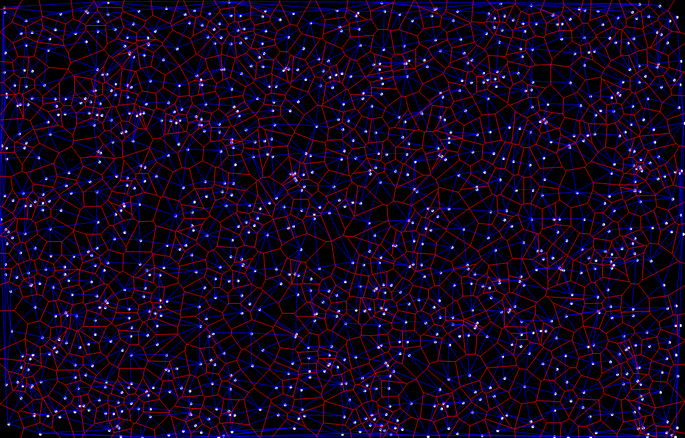

# Voronoi-Delaunay

This is an implementation and visualization of [Voronoi diagram](https://en.wikipedia.org/wiki/Voronoi_diagram) and [Delaunay triangulation](https://en.wikipedia.org/wiki/Delaunay_triangulation) in C#.

In this implementation, Voronoi diagram is obtained from generating its dual, Delaunay triangulation, which is derived in a very simple manner, [the Bowyer-Watson algorithm](https://en.wikipedia.org/wiki/Bowyer%E2%80%93Watson_algorithm). The most naïve implementation of Bowyer-Watson algorithm takes O(n^2) time. With the help of [the JavaScript implementation](https://github.com/ironwallaby/delaunay) of [@ironwallaby](https://github.com/ironwallaby), the time complexity is reduced by sorting the points by x-coordinate and using an open list and a closed list to store Delaunay triangles in each insertion of point.

For constructing Voronoi diagram, a data structure is used of storing each point with a triangle list containing all the triangles incident on it. Thus, by traversing the triangle lists of the two end points, we can directly find the two adjacent triangles of a certain Delaunay edge and connect the centers of their circumcircles. As Delaunay triangulation is a planar graph, the procedure of finding adjacent triangles takes constant time and the total time of generating Voronoi diagram is O(n).

In addition, another version of this implementation can be found in [the animation branch](https://github.com/IsaacGuan/Voronoi-Delaunay/tree/animation) of this repository that shows the Bowyer-Watson algorithm in steps. You could visit [my blog](https://isaacguan.github.io/2017/12/22/Implementation-of-Voronoi-Diagram-and-Delaunay-Triangulation/) for more specifics of the implementation.

